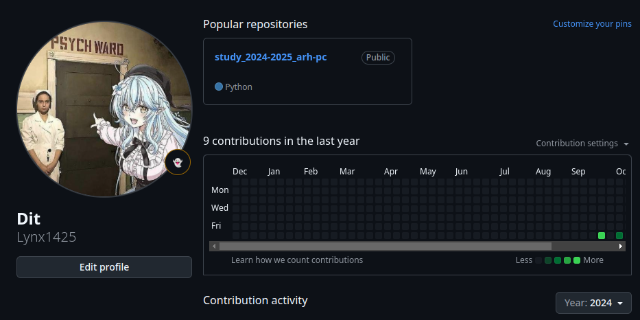
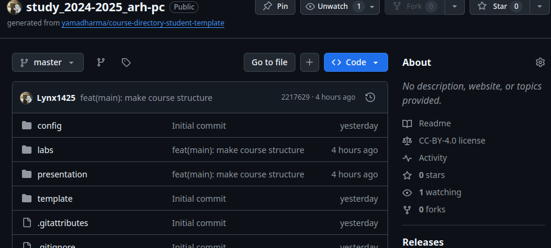
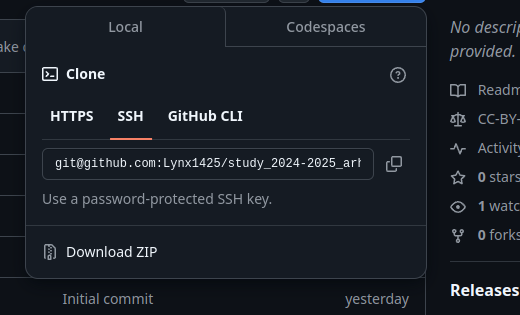
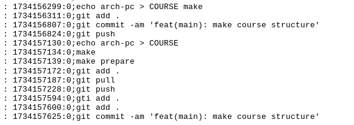
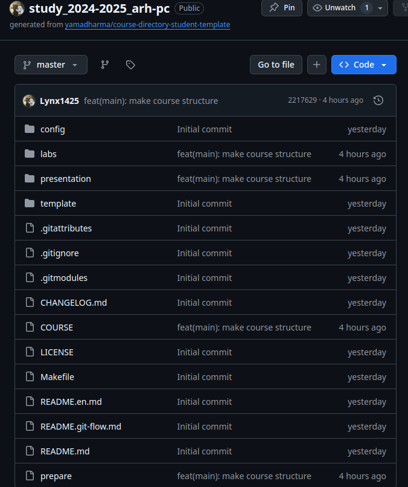
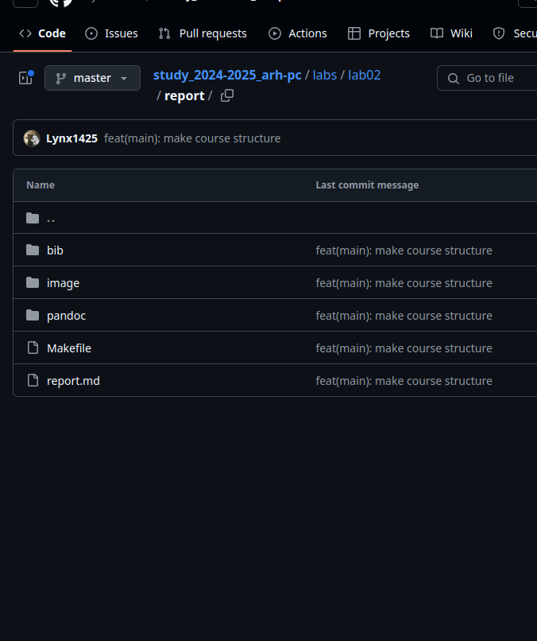

---
## Front matter
title: "Отчет по лабораторной работе №2"
subtitle: "Дисциплина: Архитектура компьютера"
author: "Тищенко Диана Борисовна"

## Generic otions
lang: ru-RU
toc-title: "Содержание"

## Bibliography
bibliography: bib/cite.bib
csl: pandoc/csl/gost-r-7-0-5-2008-numeric.csl

## Pdf output format
toc: true # Table of contents
toc-depth: 2
lof: true # List of figures
lot: true # List of tables
fontsize: 12pt
linestretch: 1.5
papersize: a4
documentclass: scrreprt
## I18n polyglossia
polyglossia-lang:
  name: russian
  options:
	- spelling=modern
	- babelshorthands=true
polyglossia-otherlangs:
  name: english
## I18n babel
babel-lang: russian
babel-otherlangs: english
## Fonts
mainfont: IBM Plex Serif
romanfont: IBM Plex Serif
sansfont: IBM Plex Sans
monofont: IBM Plex Mono
mathfont: STIX Two Math
mainfontoptions: Ligatures=Common,Ligatures=TeX,Scale=0.94
romanfontoptions: Ligatures=Common,Ligatures=TeX,Scale=0.94
sansfontoptions: Ligatures=Common,Ligatures=TeX,Scale=MatchLowercase,Scale=0.94
monofontoptions: Scale=MatchLowercase,Scale=0.94,FakeStretch=0.9
mathfontoptions:
## Biblatex
biblatex: true
biblio-style: "gost-numeric"
biblatexoptions:
  - parentracker=true
  - backend=biber
  - hyperref=auto
  - language=auto
  - autolang=other*
  - citestyle=gost-numeric
## Pandoc-crossref LaTeX customization
figureTitle: "Рис."
tableTitle: "Таблица"
listingTitle: "Листинг"
lofTitle: "Список иллюстраций"
lotTitle: "Список таблиц"
lolTitle: "Листинги"
## Misc options
indent: true
header-includes:
  - \usepackage{indentfirst}
  - \usepackage{float} # keep figures where there are in the text
  - \floatplacement{figure}{H} # keep figures where there are in the text
---

# Цель работы

Целью данной лабораторной работы является получение практических
навыков работы с системой Git при помощи командной строки. В ходе неё
мы я изучить идеологию и применение средств контроля версий.

# Задание

1. Настройка github.

2. Базовая настройка git.

3. Создание SSH ключа.

4. Создание рабочего пространства и репозитория курса на основе шаблона. 

5. Создание репозитория курса на основе шаблона.

6. Настройка каталога курса.

7. Выполнение заданий для самостоятельной работы.

# Теоретическое введение

Системы контроля версий (Version Control System, VCS) применяются при работе нескольких человек над одним проектом. Обычно основное дерево проекта хранится в локальном или удалённом репозитории, к которому настроен доступ для участников проекта. При внесении изменений в содержание проекта система контроля версий позволяет их фиксировать, совмещать изменения, произведённые разными участниками проекта, производить откат к любой более ранней версии проекта, если это требуется. В классических системах контроля версий используется централизованная модель, предполагающая наличие единого репозитория для хранения файлов. Выполнение большинства функций по управлению версиями осуществляется специальным сервером. Участник проекта (пользователь) перед началом работы посредством определённых команд получает нужную ему версию файлов. После внесения изменений пользователь размещает новую версию в хранилище. При этом предыдущие версии не удаляются из центрального хранилища и к ним можно вернуться в любой момент. Сервер может сохранять не полную версию изменённых файлов, а производить так называемую дельта-компрессию — сохранять только изменения между последовательными версиями, что позволяет уменьшить объём хранимых данных. Системы контроля версий поддерживают возможность отслеживания и разрешения конфликтов, которые могут возникнуть при работе нескольких человек над одним файлом. Можно объединить изменения, сделанные разными участниками, вручную выбрать нужную версию, отменить изменения вовсе или заблокировать файлы для изменения. В зависимости от настроек блокировка не позволяет другим пользователям получить рабочую копию или препятствует изменению рабочей копии файла средствами файловой системы ОС, обеспечивая таким образом привилегированный доступ только одному пользователю, работающему с файлом. Системы контроля версий также могут обеспечивать дополнительные, более гибкие функциональные возможности. Например, они могут поддерживать работу с несколькими версиями одного файла, сохраняя общую историю изменений до точки ветвления версий и собственные истории изменений каждой ветви. Обычно доступна информация о том, кто из участников, когда и какие изменения вносил. Обычно такого рода информация хранится в журнале изменений, доступ к которому можно ограничить. В отличие от классических, в распределённых системах контроля версий центральный репозиторий не является обязательным. Среди классических VCS наиболее известны CVS, Subversion, а среди распределённых — Git, Bazaar, Mercurial. Принципы их работы схожи, отличаются они в основном синтаксисом используемых в работе команд. Система контроля версий Git представляет собой набор программ командной строки. Доступ к ним можно получить из терминала посредством ввода команды git с различными опциями. Благодаря тому, что Git является распределённой системой контроля версий, резервную копию локального хранилища можно сделать простым копированием или архивацией. Работа пользователя со своей веткой начинается с проверки и получения изменений из центрального репозитория (при этом в локальное дерево до начала этой процедуры не должно было вноситься изменений). Затем можно вносить изменения в локальном дереве и/или ветке. После завершения внесения какого-то изменения в файлы и/или каталоги проекта необходимо разместить их в центральном репозитории.

# Выполнение лабораторной работы

Создаю учетную запись на сайте Github. Заполняю основные данные для учетной
записи. (Рис. [-@fig:001])

{#fig:001 width=70%}

Открываем терминал, делаю конфигурацию git. Вводим команду git config --global
user.name и указываем имя, следом вводим git config --global user.email, вписывая
электронную почту аккаунта github. Настраиваем utf- в выводе сообщений git.
Задаем имя для начальной ветки. Она будет называться «master». Задаем
параметры autocrlf и safecrlf для корректного выполнения команд. (Рис.[-@fig:002])

{#fig:002 width=70%}

Для последующей идентификации пользователя на сервере репозиториев
необходимо сгенерировать пару ключей (приватный и открытый). Для этого
вводим в командную строку команду ssh-keygen –C “”, вводя имя пользователя и
электронную почту. (Рис. [-@fig:003])

{#fig:003 width=70%}

Загружаем сгенерированный открытый ключ. Заходим на сайт под своей учетной
записью, переходим в меню, находим меню ключей и создаем новый ключ.
Копируем из локальной консоли ключ в буфер обмена и используем команду cat.
(Рис. [-@fig:004])

{#fig:004 width=70%}

Вставляем ключ в поле сайта и указываем имя для ключа. (Рис. [-@fig:005])

{#fig:005 width=70%}

Создание рабочего пространства и репозитория курса на основе шаблона.
Открываем терминал и создаем каталог для предмета “Архитектура компьютера”.
(Рис. [-@fig:006])

{#fig:006 width=70%}

Создание репозитория курса на основе шаблона. Переходим на станицу github в
репозиторий с шаблоном курса https://github.com/yamadharma/course-directorystudent-template. Далее выбираем “Use this template”. В открывшемся окне задаем
имя репозитория. Создаем репозиторий. Проверяем создался ли репозиторий.
(Рис. [-@fig:007])

{#fig:007 width=70%}

Открываем терминал и переходим в каталог курса при помощи cd и клонируем
созданный репозиторий и помощи команды git clone –recursive ‘’. (Рис. [-@fig:008])

{#fig:008 width=70%}

Копируем ссылку для клонирования на странице созданного репозитория.
Переходим в окно Code, следом в SSH. (Рис. [-@fig:009])

{#fig:009 width=70%}

Настройка каталога курса. Переходим в каталог курса при помощи cd. Удаляем
лишние файлы. (Рис. [-@fig:010])

{#fig:010 width=70%}

Создаем необходимые каталоги. Отправляем файлы на сервер используя команды
git add ., git commit –am и git push. (Рис. [-@fig:011])

{#fig:011 width=70%}

Проверяем правильность создания иерархии рабочего пространства в локальном
репозитории и на странице github. (Рис. [-@fig:012])

{#fig:012 width=70%}

# Выполнение заданий для самостоятельной работы

Переходим в labs/lab02/report с помощью cd. Создаем файл для отчета по
лабораторной работе, копируем первую лабораторную с помощью и проверяем
правильность выполнения команды. Переходим в подкаталог lab02/report.
Копируем вторую лабораторную в каталог. 

При помощи команды git add ‘’ добавляем новые файлы. Сохраняем изменение при
помощи команды git commit – am. Переносим в репозиторий сохраненные
изменения командой git push. 

Проверяем на сайте правильность выполнения заданий. (Рис. [-@fig:013])
{#fig:013 width=70%}

# Вывод

При выполнении данной лабораторной работы я изучил идеологию и применение
средств контроля версий, а также приобрел практические навыки по работе с
системой git.

# Список литературы{.unnumbered}

::: {#refs}
:::
