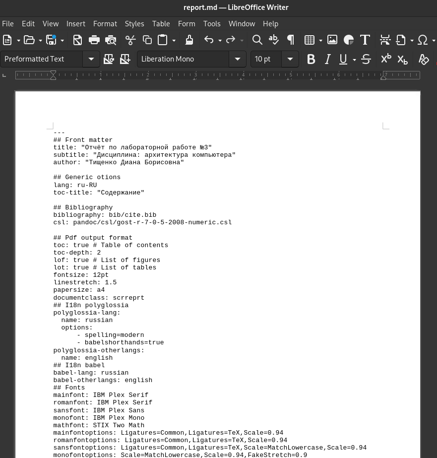
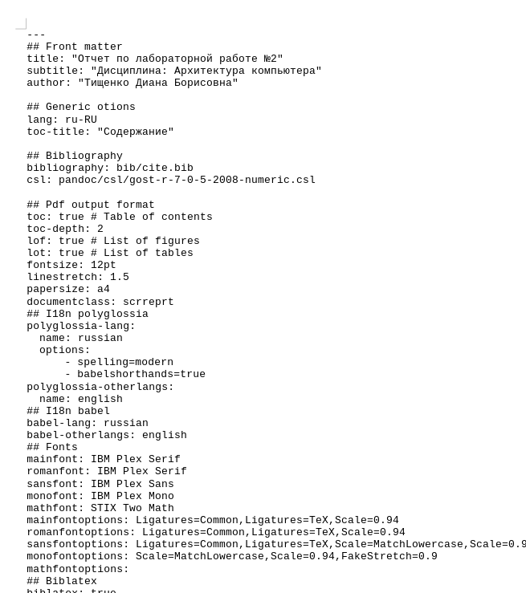
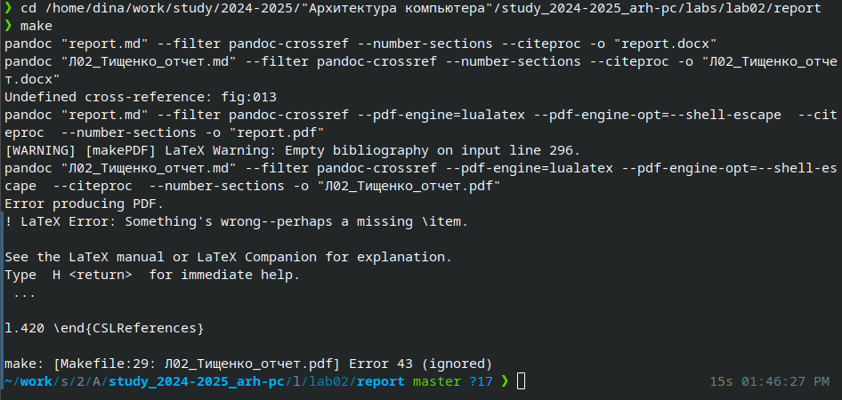

---
## Front matter
title: "Отчёт по лабораторной работе №3"
subtitle: "Дисциплина: архитектура компьютера"
author: "Тищенко Диана Борисовна"

## Generic otions
lang: ru-RU
toc-title: "Содержание"

## Bibliography
bibliography: bib/cite.bib
csl: pandoc/csl/gost-r-7-0-5-2008-numeric.csl

## Pdf output format
toc: true # Table of contents
toc-depth: 2
lof: true # List of figures
lot: true # List of tables
fontsize: 12pt
linestretch: 1.5
papersize: a4
documentclass: scrreprt
## I18n polyglossia
polyglossia-lang:
  name: russian
  options:
	- spelling=modern
	- babelshorthands=true
polyglossia-otherlangs:
  name: english
## I18n babel
babel-lang: russian
babel-otherlangs: english
## Fonts
mainfont: IBM Plex Serif
romanfont: IBM Plex Serif
sansfont: IBM Plex Sans
monofont: IBM Plex Mono
mathfont: STIX Two Math
mainfontoptions: Ligatures=Common,Ligatures=TeX,Scale=0.94
romanfontoptions: Ligatures=Common,Ligatures=TeX,Scale=0.94
sansfontoptions: Ligatures=Common,Ligatures=TeX,Scale=MatchLowercase,Scale=0.94
monofontoptions: Scale=MatchLowercase,Scale=0.94,FakeStretch=0.9
mathfontoptions:
## Biblatex
biblatex: true
biblio-style: "gost-numeric"
biblatexoptions:
  - parentracker=true
  - backend=biber
  - hyperref=auto
  - language=auto
  - autolang=other*
  - citestyle=gost-numeric
## Pandoc-crossref LaTeX customization
figureTitle: "Рис."
tableTitle: "Таблица"
listingTitle: "Листинг"
lofTitle: "Список иллюстраций"
lotTitle: "Список таблиц"
lolTitle: "Листинги"
## Misc options
indent: true
header-includes:
  - \usepackage{indentfirst}
  - \usepackage{float} # keep figures where there are in the text
  - \floatplacement{figure}{H} # keep figures where there are in the text
---

# Цель работы

Целью данной лабораторной работы является освоение процедуры оформления отчетов с помощью легковесного языка разметки Markdown.

# Задание

1. Заполнение отчета по выполнению лабораторной работы №4 с помощью
языка разметки Markdown

2. Задание для самостоятельной работы

# Теоретическое введение

Markdown - легковесный язык разметки, созданный с целью обозначения форматирования в простом тексте, с максимальным сохранением его читаемости
человеком, и пригодный для машинного преобразования в языки для продвинутых публикаций. Внутритекстовые формулы делаются аналогично формулам
LaTeX. В Markdown вставить изображение в документ можно с помощью непосредственного указания адреса изображения. Синтаксис Markdown для встроенной
ссылки состоит из части link text, представляющей текст гиперссылки, и части (file-name.md) – URL-адреса или имени файла, на который дается ссылка.
Markdown поддерживает как встраивание фрагментов кода в предложение, так
и их размещение между предложениями в виде отдельных огражденных блоков. Огражденные блоки кода — это простой способ выделить синтаксис для
фрагментов кода.

# Заполнение отчета по выполнению лабораторной работы №3

Открываю терминал. Перехожу в каталог курса, сформированный при выполненнии прошлой лаборатной работы.(рис. [-@fig:001]).

{#fig:001 width=70%}

Обновляю локальный репозиторий, скачав изменения из удаленного репозитория с помощью команды git pull (рис. [-@fig:002]).

{#fig:002 width=70%}

Перехожу в каталог с шаблоном отчета по лабораторной работе №3 с помощью
cd (рис. [-@fig:003]).

{#fig:003 width=70%}

Компилирую шаблон с использованием Makefile, вводя команду make (рис.
[-@fig:004]).

{#fig:004 width=70%}

Открываю сгенерированные файлы и убеждаюсь, что все правильно сгенерировалось (рис. [-@fig:005]).

{#fig:005 width=70%}

Удаляю полученные файлы с использованием Makefile, вводя команду make
clean (рис. [-@fig:006]). С помощью команды ls проверяю, удалились ли созданные
файлы.

{#fig:006 width=70%}

Открываю файл report.md с помощью любого текстового редактора mousepad
(рис. [-@fig:007])

{#fig:007 width=70%}

Начинаю заполнять отчет с помощью языка разметки Markdown в скопированном файле (рис. [-@fig:008]).

{#fig:008 width=70%}

Компилирую файл с отчетом. Загружаю отчет на GitHub.

# Задание для самостоятельной работы

Перехожу в директорию lab02/report с помощью cd, чтобы там заполнять отчет по второй лабораторной работе (рис. [-@fig:009]).

{#fig:009 width=70%}

Копирую файл report.md с новым именем для заполненния отчета (рис. [-@fig:010])

{#fig:010 width=70%}

Открываю файл с помощью текстового редактора mousepad и начинаю заполнять отчет (рис. [-@fig:011]).

{#fig:011 width=70%}

Компилирую файл с отчетом по лабораторной работе (рис. [-@fig:012]).

{#fig:012 width=70%}

Добавляю изменения на GitHub с помощью комнады git add и сохраняю изменения с помощью commit (рис. [-@fig:013]).

{#fig:013 width=70%}

Отправляю файлы на сервер с помощью команды git push (рис. [-@fig:014]).

{#fig:014 width=70%}

# Выводы

В результате выполнения данной лабораторной работы я освоила процедуры оформления отчетов с помощью легковесного языка разметки Markdown.
